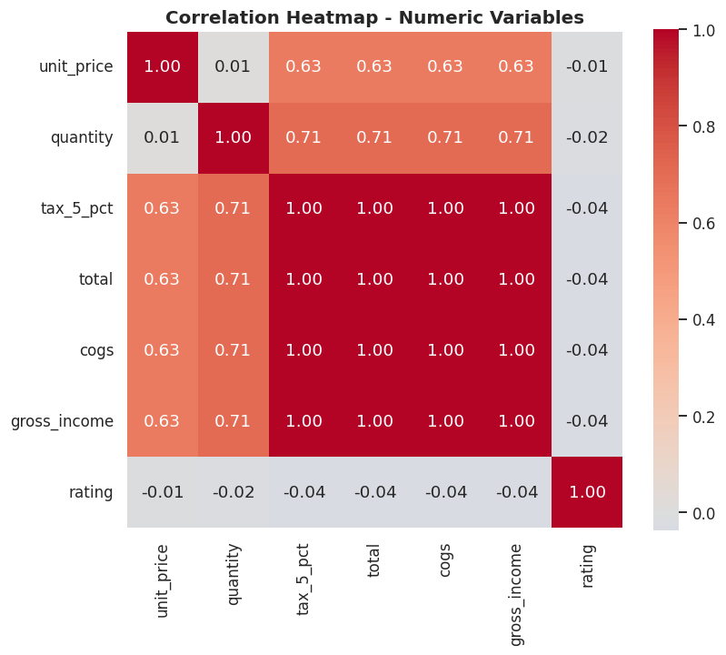
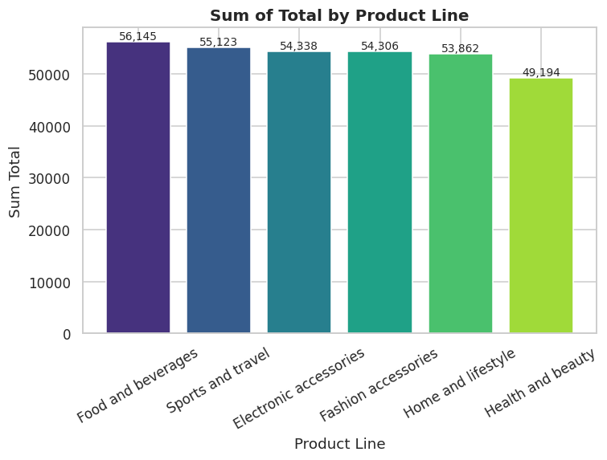
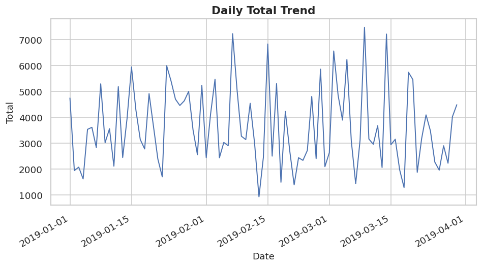

# 🛒 Exploratory Data Analysis Project — Supermarket Sales

An end-to-end Exploratory Data Analysis project using Python to clean, analyze, visualize, and
extract actionable insights from real-world supermarket transaction data.


---

## 📌 Overview

This project performs a complete Exploratory Data Analysis (EDA) on **1,000 point-of-sale
transactions** from three branches of a supermarket chain, recorded over a three-month period
(January – March 2019). The goal is to move beyond surface-level charts and produce a
structured, statistically grounded analysis that a Data Analyst could realistically hand to a
retail operations or marketing team.

The project covers the full analytics workflow: raw data ingestion, data-quality validation and
cleaning, univariate/bivariate/multivariate analysis, correlation analysis, and a set of
quantified business insights and recommendations — all reproducible from a single notebook or
via the standalone Python scripts in `src/`.

## 🎯 Objectives

- Validate and document the quality of a real transactional dataset before analyzing it
- Identify which product lines, branches, and customer segments drive the most revenue and
  profit
- Quantify correlations between price, quantity, revenue, and customer satisfaction
- Detect and interpret time-based demand patterns (day of week, month)
- Translate findings into specific, data-backed business recommendations

## 📊 Dataset

- **Name:** Supermarket Sales
- **Source:** [Kaggle — aungpyaeap/supermarket-sales](https://www.kaggle.com/datasets/aungpyaeap/supermarket-sales)
  (see `data/README.md` for full attribution and license notes)
- **Records:** 1,000 transactions
- **Features:** 17 raw columns (6 categorical, 7 numeric, 2 date/time)
- **Key variables:** `Branch`, `City`, `Customer type`, `Gender`, `Product line`, `Unit price`,
  `Quantity`, `Total`, `Payment`, `Date`, `Time`, `Rating`

## 🛠️ Technologies Used

- **Python 3.10+**
- **Pandas** — data manipulation and aggregation
- **NumPy** — numerical operations
- **Matplotlib** — base plotting
- **Seaborn** — statistical visualizations
- **Jupyter Notebook** — analysis narrative and interactive exploration

## 🔍 Analysis Performed

- **Data cleaning:** missing-value and duplicate checks, column-name standardization,
  date/time type correction, feature engineering (`month`, `day_of_week`, `hour`),
  business-rule validation (price/quantity sanity checks, total-formula reconciliation), and
  IQR-based outlier detection
- **Statistical analysis:** descriptive statistics (mean, median, std, quartiles, skew) for all
  key numeric variables, plus grouped statistics by branch, product line, customer type, and
  payment method
- **Univariate analysis:** distribution and boxplots for `total`, `unit_price`, `quantity`,
  `rating`; count plots for categorical fields
- **Bivariate analysis:** revenue by product line/city/day-of-week, spend by customer type,
  scatter plots of price/quantity vs. total, rating by product line
- **Multivariate analysis:** full correlation matrix and heatmap, pairplot segmented by
  customer type, city × product-line revenue pivot table
- **Correlation analysis:** identification of which numeric variables genuinely drive
  transaction value vs. which are mathematically derived from one another
- **Visualization:** 22 professional, labeled, annotated charts saved under `visualizations/`

## 📈 Key Insights

1. **Food and beverages** is the top revenue category (≈ $56,145), ~12% ahead of the weakest
   category, **Health and beauty**.
2. **Branch C (Naypyitaw)** earns the most total revenue (≈ $110,569) with the *fewest*
   transactions of the three branches — it wins on basket size, not footfall.
3. **Saturday** generates ~48% more revenue than the weakest day, **Monday** — a clear weekly
   demand cycle.
4. **Member customers** contribute ~3.4% more total revenue than Normal customers on almost
   identical transaction counts.
5. **Quantity purchased (r = 0.71)** is a stronger driver of transaction value than
   **unit price (r = 0.63)**.
6. **Customer rating is statistically independent of spend** (|r| < 0.05 against every
   financial variable) — bigger spenders are not more satisfied customers.
7. The dataset is exceptionally clean: **zero missing values, zero duplicates, zero
   business-rule violations**; only 9 legitimate high-value outlier transactions were found.

Full details, quantified evidence, and 12 total insights are in
[`reports/EDA_Report.md`](reports/EDA_Report.md) and the notebook.

## 💡 Recommendations

1. Prioritize marketing spend on Food & beverages and Sports & travel — proven demand leaders.
2. Investigate basket-value levers (bundling, upselling) for the underperforming Health and
   beauty category.
3. Study and replicate Branch C's higher-basket-value operating model at Branches A and B.
4. Align staffing and promotions with the Saturday-peak / Monday-trough weekly cycle.
5. Expand the Membership program, but validate causality with a controlled sign-up test.
6. Track customer satisfaction as an independent KPI rather than assuming it follows revenue.
7. Keep cash/Ewallet checkout frictionless rather than over-investing in card incentives.
8. Extend the observation window to 12 months before committing budget to seasonal campaigns.

Full fact → interpretation → action breakdown for each recommendation is in
[`reports/EDA_Report.md`](reports/EDA_Report.md).

## 📁 Project Structure

```text
Exploratory-Data-Analysis-Project/
│
├── data/
│   ├── raw/
│   │   └── dataset.csv
│   ├── cleaned/
│   │   └── cleaned_dataset.csv
│   └── README.md
│
├── notebooks/
│   └── EDA_Project.ipynb
│
├── src/
│   ├── data_cleaning.py
│   └── analysis.py
│
├── visualizations/
│   ├── distribution_plots/
│   ├── correlation_plots/
│   └── categorical_analysis/
│
├── reports/
│   └── EDA_Report.md
│
├── README.md
├── requirements.txt
├── .gitignore
└── LICENSE
```

## 🚀 How to Run

```bash
git clone <repository-url>
cd Exploratory-Data-Analysis-Project
pip install -r requirements.txt
jupyter notebook notebooks/EDA_Project.ipynb
```

To regenerate the cleaned dataset and all visualizations from the command line instead:

```bash
python src/data_cleaning.py
python src/analysis.py
```

## 📷 Visualizations

A few highlights from `visualizations/` (22 total charts):

| Correlation Heatmap | Revenue by Product Line | Daily Revenue Trend |
|---|---|---|
|  |  |  |

See the `visualizations/` folder for the complete set, organized into
`distribution_plots/`, `correlation_plots/`, and `categorical_analysis/`.

## 🔮 Future Improvements

- Extend the dataset to a full 12-month window to properly test seasonality
- Add operational variables (staffing levels, queue time) to explain rating variance
- Run a controlled experiment on the Membership program to establish causality on spend
- Build an interactive dashboard (e.g. Streamlit or Plotly Dash) on top of the cleaned dataset
- Add automated data-quality tests (e.g. `pytest` + `great_expectations`) around
  `src/data_cleaning.py`

## 👩‍💻 Author

**Sanjana R**
Computer Science & Engineering Student
Aspiring Data Analyst | Data Science & AI Enthusiast

GitHub: [https://github.com/sanjanarajur](https://github.com/sanjanarajur)

---

### Suggested GitHub repository topics

```text
python
data-analysis
eda
pandas
numpy
matplotlib
seaborn
data-science
data-visualization
jupyter-notebook
```
